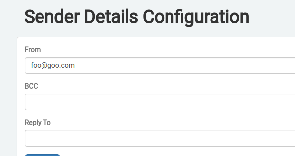
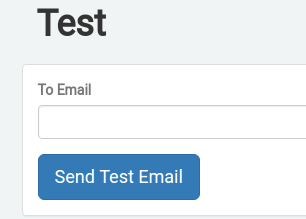
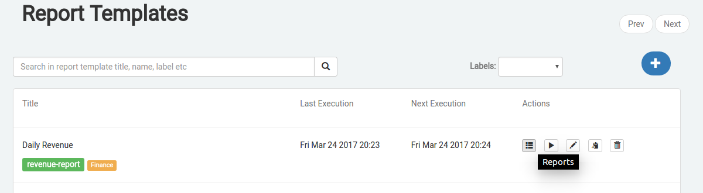
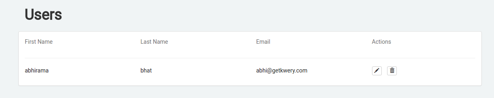
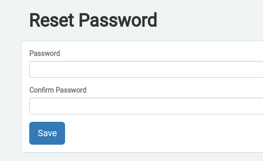
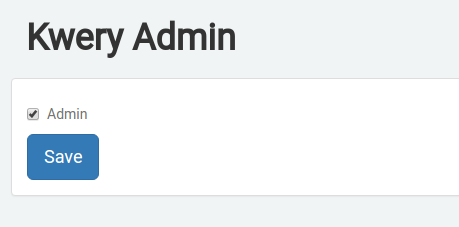

# Kwery

Kwery makes it simple and easy to generate, schedule, view and email business reports from datasources using SQL.

---

## Supported datasources

* MySQL
* Postgres
* AWS Redshift
* SQL Server

More datasources are coming soon.

## Installation

You can run Kwery on your desktop too for testing etc but the advised way is to run it on a server so that everyone in your organisation is empowered to generate, schedule and email reports.

### Download Kwery

If you have not already downloaded Kwery, the first thing you have to do is [download Kwery](https://s3.ap-south-1.amazonaws.com/kwery-download/1.7.2-snapshot/kwery-1.7.2-SNAPSHOT.jar). Create a folder on your server called kwery and save the jar file in that folder. It is advisable to run Kwery from a folder of it's own because on startup, Kwery creates certain folders of it's own which it uses for storing search indexes, metadata etc. ___**Do not tamper with any of these folders, you might accidentally corrupt the data thus losing all your precious work. Also, once you have Kwery up and running, do not delete any of these folders, you will end up losing all your work.**___

### Verify Java 8 is installed

Type the below in a terminal to ensure you have Java 8 installed and running.

```bash
java -version
```

You should see an output like this

```bash
java version "1.8.0_91"
Java(TM) SE Runtime Environment (build 1.8.0_91-b14)
Java HotSpot(TM) 64-Bit Server VM (build 25.91-b14, mixed mode)
```

Kwery works with any Java runtime, be it Sun Java, Open JDK or some other vendor supplied Java.


###Launching Kwery

Run the below in a terminal

```bash
java -jar kwery.jar
```

This will start Kwery on port 8080. By default, Kwery creates a log file kwery.log in the folder from which it is run. If Kwery encounters any problem while starting up, it will log it in the log file. 

You can change Kwery port, log file location etc using the below JVM switches.

Change port

```
java -jar -Dninja.port=9000 kwery.jar
```

This will start Kwery on port 9000.

Change log file location

```
java -jar -DlogFilePath=/var/log kwery.jar
```
kwery.log will be created in /var/log folder.

To keep Kwery running once you log off from the server, you have to either background Kwery or run it as a daemon/service. Backgrounding is the easiest, add an & at the end of the jar command as below

```
java -jar  kwery.jar &
```

If you want to run Kwery as a service/daemon, you can either use <a href="http://supervisord.org" target="_blank">supervisor</a> or write your own init scripts.

##Register datasource

Click on Datasorces on the navbar and then click on the + button on the datasources list page.


Fill in the details in the Datasource page. Ensure that the server where you are running Kwery can connect to the datasource.


##Add report template

Click on Reports and then in the dropdown, click on List.


Report template has multiple sections, many of them are self explanatory, we will go over the important ones one by one.

###Label

A report template can have multiple labels. You can use the plus button to add more labels and use the trash button to delete labels from report templates.


###Schedule

Schedule determines the frequency at which the report is generated, it can be as less as every minute.


You can use the GUI or enter a cron expression to schedule reports.

Also, report generation can be chained to say that generate this report after another report. Use the 'After' option for this.

###Report Subscription Email

Comma separated list of email addresses to which the generated report will be emailed to. Also, you can opt out of sending an email if the report is empty i.e the SQL query returned an empty result set.

Unless you configure [SMTP](#smtp-configuration) and [Sender details](#sender-details-configuration), this feature is disabled.


###Failure Alert Email

Comma separated list of email addresses which will be alerted in case report generation fails.

Unless you configure [Kwery URL](#kwery-url), this feature is disabled.


###SQL Query

The output of the SQL query forms the report content. A report can have multiple SQL queries from different datasources. Use 'Add Another SQL Query' option to add multiple SQL queries. 


When you have multiple SQL queries, you can use the trash button to delete a SQL query. 


If you have opted for emails, SQL query output is part of the body of the email as well as sent as an attachment with each mail. You can configure this using the below.


If there are multiple SQL queries in a report, they are executed in parallel to reduce the report generation time. You can get the reports executed sequentially one after the other using the below option. If one of the SQL query fails during sequential execution, the subsequent SQL queries can be stopped from getting executed.


##Report Template Label

Labels let you organise, search and filter report templates. Click on Reports and once the dropdown is shown, click on Labels to add/modify labels.


You can search a report template based on labels in the report template list page.


Report templates can also be filtered using labels.


##Email Configuration

Click on Settings and then in the dropdown on Email to configure SMTP and email setting.

###SMTP Configuration

If you have configured Postfix on the server running Kwery, then you can use 'Use local SMTP settings' to delegate email sending to the configured local Postfix instance. If not, you can use the SMTP server of your choice by entering the additional details.


###Sender Details Configuration

From address of email sent from Kwery, bcc and reply to email addresses are configured here.



###Test Email Configuration

Once you have saved SMTP and Sender Details configuration, test as to whether you can send emails successfully using 'Send Test Email' button.



##Kwery URL

In order to embed report links in email, Kwery needs to know the url at which it is running. Click on 'Settings' followed by 'Kwery URL' to configure URL.


Kwery pre populates the fields with values, if anything is amiss, fix it and save.


##Executing Reports

By clicking on 'Reports' on the navbar followed by 'Executing', you can view the list of executing reports. 


If at any point of time, you want to stop a report generation, click on the stop button.


##Report view, download and search

A report can be viewed from the Reports list page. Click on the 'Reports' icon and in the following page, click on the 'Report' icon.




###Report Search

You can search for a report generated between a particular time as shown below.


###Download

In the report view page, click on the 'Download' icon to download a report as CSV.


##User Management

Click on 'Settings' in the navbar and then on 'Users' in the dropdown to manage users. This feature is available only to admins.

The first user who signs up is given admin privileges.


 

An admin can promote other users to admin. An admin can also reset user passwords.






